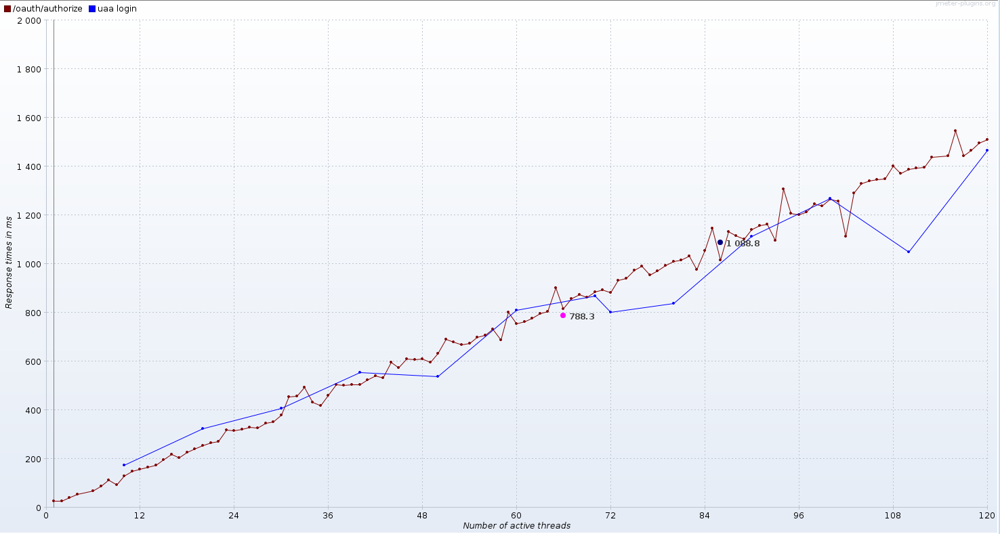

# jmeter
repo for jmeter scripts to demonstrate jmeter capabilities. 

##Complex Multistep Flow - Example Output

## Introduction
We currently have four different kinds of tests added

* client_credentials - simple client_credentials grant type
* password - simple password grant type
* login and authorize - login and authorize then logout
* login then repeat authorize - login once, then repeat oauth/authorize with the authenticated session

# setup
This repository has everything, with the exception for Java VM,  you need to run Apache Jmeter
We use `.envrc` to automatically configure your path. 
If you do not use [direnv](https://github.com/direnv/direnv) you have to run a bash shell and run the command

    source .envrc
    
Verify that jmeter is on your path by typing `which jmeter`

# performance tests

## Authorization Code Flow

### prerequisites
Our load test assumes that the user has already approved necessary scopes. 
The load test just test the login/authorize actions.
1. launch UAA in a separate window using the command `./gradlew run`
1. Go to the [sample app, http://localhost:8080/app](http://localhost:8080/app)
1. Login using `marissa/koala` and accept all scopes

### Login-Authorize-Logout
#### launch jmeter

    jmeter -t uaa/simple-auth-code-test.jmx

Press the `Play` button or use the menu Run->Start to launch the test

### Login-Authorize-Repeat-Authorize
#### launch jmeter

    jmeter -t uaa/login-then-auth-code-test.jmx

Press the `Play` button or use the menu Run->Start to launch the test

## Client Credentials Flow

### prerequisites
UAA is up and running and has the `admin` client with the password `adminsecret`

### launch jmeter

     jmeter -t uaa/simple-client-credentials.jmx

## Password Flow

### prerequisites
UAA is up and running and has the `cf` client with the password `<empty string>` 
and user `marissa` with password `koala`.

### launch jmeter

     jmeter -t uaa/simple-password-grant.jmx
